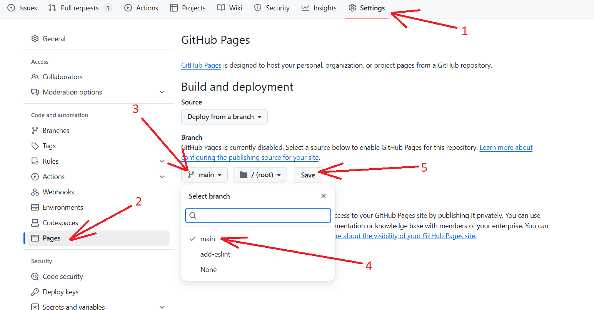
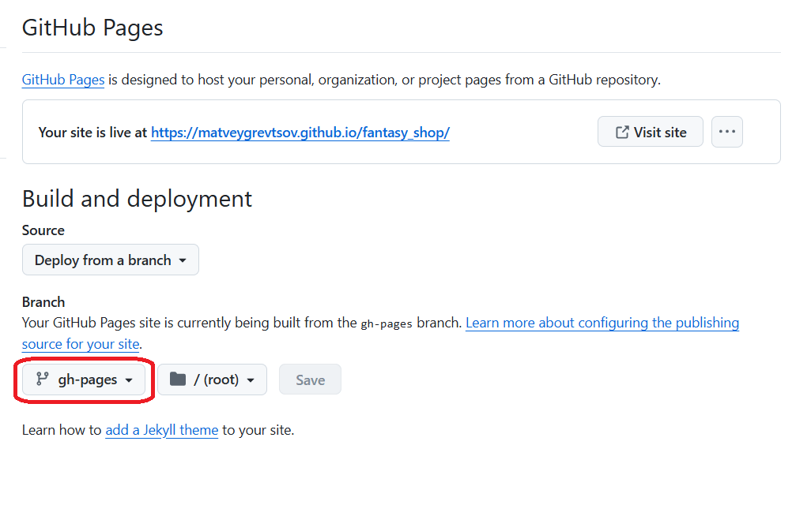

# Хостинг проекта на gh-pages

## Шаг№1: устанавливаем библиотеку gh-pages

```console
npm install gh-pages -D -E
```

## Шаг№2: получаем ссылку на наш будущий сайт

Для этого переходим на сайт github.com, в наш репозиторий, в раздел "Settings > Pages > Branch" и выбираем main (либо master). Нажимаем кнопку save, и ждем несколько секунд (обновляем страницу в браузере) до тех пор, пока не появится ссылка на наш будущий сайт.



## Шаг№3: правим package.json

Добавляем поле "homepage" и, в качестве значения, указываем ссылку из предыдущего пункта:

```console
"homepage": "https://matveygrevtsov.github.io/.../"
```

Добавляем скрипты для предеплоя и деплоя:

```console
"predeploy": "npm run build",
"deploy": "gh-pages -d build" (build - это папка, куда собирается проект. В некоторых проектах она называется "dist")
```

Эти изменения пушим в наш репозиторий.

## Шаг№4: создаём ветку gh-pages

На этой ветке будет храниться билд проекта, который и будет показываться юзеру.

```console
git checkout -b gh-pages
git push
```

## Шаг№5: устанавливаем ветку gh-pages в разделе "Settings > Pages > Branch"



## Шаг№6: деплоим

Запускаем команду:

```console
npm run deploy
```

эта команда сбилдит проект, и полученный билд зальёт на ветку gh-pages. Далее, нужно немного подождать (2 - 3 минуты), и можно заходить на наш сайт. Деплой автоматически запускаться не будет, поэтому, если мы замержили в master (main) новые изменения, нужно снова вручную запускать команду `npm run deploy`.

## Шаг№7: если используем webpack, нужно настроить BASE_URL

Устанавливаем библиотеку, чтобы переменные окружения можно было прокидывать прямо в команды:

```console
npm install cross-env -D -E
```

Правим скрипты в package.json:

```console
"build": "cross-env BASE_URL=/ npx webpack --mode production"
"predeploy": "cross-env BASE_URL=https://matveygrevtsov.github.io/.../ npx webpack --mode production",
```

В public/index.html прокидываем переменную окружения в тег base:

```html
<base href="<%= htmlWebpackPlugin.options.BASE_URL %>" />
```

Правим конфиг плагина HtmlWebpackPlugin, чтобы переменная окружения BASE_URL использовалась во время сборки:

```js
{
  plugins: [
    new HtmlWebpackPlugin({
      template: "./public/index.html",
      BASE_URL: process.env.BASE_URL,
    }),
  ];
}
```
